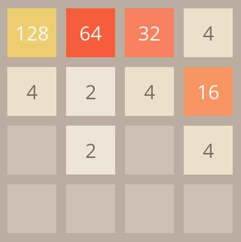

# 2048

A fully animated clone of 2048 written in C++ using SDL2.

This version includes hand-coded, smooth animations for tile shifting, merging,
and spawning.

I wrote this up for fun over a weekend, as such I can't guarantee that it is
bug-free.  It is fully open-source and free to use.  You can freely modify it or
integrate it into any new or existing project.

I don't plan on doing any more major work on it in the future.



## Building and Running the Game

To build it, you only need:

- C++ 17
- SDL2
- SDL2 TTF 

Once you have these installed, modify the CMake file to point to your
installation of SDL2 and SDL2-ttf. Then, just run:

```
cmake -S . -B out
```

to generate the build files for your project.  From here, you will need to use
whatever build system is installed on your machine to actually compile the
executable. This will typically be one of:

- Make (MacOS, Linux, mingw)
- MSBuild (MSVC)

Once the executable is compiled, make sure you have made the required dynamic
libraries for SDL available to your executable (either put them the directory
you are running the executable's working directory or install them in your
path/bin directory). The game will not run if these dynamic libraries are not
present.


